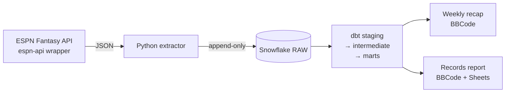

# Fantasy Beat Reporter

> An ELT pipeline that turns ESPN Fantasy Baseball box-score data into weekly
> BBCode recaps and an all-time records report. Built so the league
> commissioner spends Sunday afternoons posting copy, not pulling stats.

[](LICENSE)
[](https://www.getdbt.com/)
[](https://www.snowflake.com/)
[](https://www.python.org/)

Real product, real user (me), real weekly cadence. The codebase is also
a deliberate dbt portfolio piece — see [What this
demonstrates](#what-this-demonstrates) below.

---

## What it does

Every Sunday at the end of a fantasy matchup period, the commissioner
runs:

```bash
python extract/extract.py
cd dbt_league && dbt build
cd .. && python output/generate_summary.py > recap.txt
```

…and gets a fully-formatted ESPN-BBCode recap of the week — best/worst
matchup totals with top contributors, a wasted-performances callout, any
all-time records broken or tied, and the running current-season + all-time
records. Paste it into the league's front-page editor and ship.

There's also an all-time records report
(`output/generate_records_report.py`) that can optionally write to a
Google Sheet for offline analysis.

### Sample output

```
[u][b]Week 6 Recap[/b][/u]

[b]Best Overall[/b]: 309.4 pts by No Power, No Panic
Bobby Witt Jr.: 32.7, Cam Schlittler: 30.9, Pete Alonso: 24.8, ...
[b]Best Hitting[/b]: 184.3 pts by Intentional Walk to the Bar
Andy Pages: 37.4, Pete Crow-Armstrong: 26.4, Matt Olson: 21.2
[b]Best Pitching[/b]: 156.6 pts by Rob Manfred Death Squad
Logan Gilbert: 29.6, Nathan Eovaldi: 25.6, Rico Garcia: 20.7

[b]Top Scorer[/b]: Cristopher Sanchez (SMEL), 52.6 pts -- 15.0 IP, 17 K, 2 W, 2 QS
[b]Top Hitter[/b]: Andy Pages (WALK), 37.4 pts -- .417/.440/.917 -- 24 AB, 4 HR, 8 RBI

[u][b]Top 5 Wasted Performances[/b][/u]
1. Heliot Ramos (SF, LF) -- Atomic Alpacas Assuming Position --
   27.9 wasted pts (3.4 unowned, 20.3 benched, negative 4.2 active)
2. Brandon Marsh (Phi, LF/CF) -- Clase Action Lawsuit -- 26.2 pts
...

[u][b]New Records[/b][/u]
[b]New Worst Player Platform Hitting Points[/b]: Cal Raleigh (NPNP), -6.2 pts -- 8 AB
(Prior: -6.0 pts by Mark Vientos (NPNP) in Semi-Finals of 2025)
[b]Tied Record for Fewest RBIs[/b]: Leno's Manic Mandible at 14 RBI, the 3rd team to do so.
```

(That's a real Week 6 recap, lightly trimmed for readability.)

---

## Architecture



Three layers, two consumers. The dbt project alone is 10 models (3
staging, 2 intermediate, 5 marts); the marts split symmetrically into
active and inactive performance facts ("active = fantasy reality;
inactive = MLB reality") and feed a seed-driven leaderboard that ranks
both lenses.

Full lineage and column-level docs are in the hosted dbt catalog;
the local source-of-truth is the `dbt_league/` directory.

---

## Notable engineering decisions

Each phase of this project was designed and documented in its own
`Phase X.Y Documentation.md` file (see the repo root). A few decisions
worth surfacing:

- **Doubleheader silent-overwrite bug fix ([Phase 3.3](Phase%203.3%20Documentation.md)).**
  The `espn-api` Python wrapper builds a `scoringPeriodId → stats` dict
  and silently drops one game when ESPN returns multiple splits for the
  same period. Caught when team totals on doubleheader days were
  consistently ~3.6 pts low. Root-caused via raw-API inspection, fixed
  by going to ESPN's kona endpoint for pre-aggregation stats. Raw
  API capture preserved in `archive/` for replay.

- **Wide convergence facts over separate marts ([Phase 3.1](Phase%203.1%20Documentation.md)).**
  Counting stats, derived rate stats, and per-stat point contributions
  all sit on one wide row per `(player, week)`. Saves a join at every
  consumer; collapses what was a two-mart cross-layer dependency. The
  decision against splitting "counts" and "rates" is documented as a
  Kimball-vs-pragmatism tradeoff.

- **Slot-validity filter for two-way players ([Phase 4.0](Phase%204.0%20Documentation.md)).**
  Ohtani's hitting stats only count when he's slotted as a hitter, not
  a pitcher — even though ESPN sums both into one player-day total.
  Solved at the intermediate layer with a `stat_category = lineup_slot_category`
  filter (toggleable via `var('strict_slot_validity', true)`). Distinguishing
  "lineup slot" from "position eligibility" is the difference between a
  pipeline that handles real-world rosters and one that doesn't.

- **Anti-join for point-in-time free-agent status ([Phase 4.0](Phase%204.0%20Documentation.md)).**
  ESPN's API doesn't return historical roster status. To know who was
  a free agent on a given day, query kona without status filter and
  anti-join against the wrapper's rostered lineups for that
  scoring period. Captures transactions correctly without a transaction
  log.

- **Seed-driven Jinja UNPIVOT in `mart_stat_leaderboard` ([Phase 7](archive/phase_7_working/)).**
  The leaderboard's wide-to-long pivot used to live as a hand-maintained
  UNION block. Now it's a Jinja loop over `stat_classification.csv`. Adding
  a tracked stat is a CSV row, not a five-file SQL change. The seed
  similarly drives the Python display layer and consumer-side polarity
  rules — single source of truth across SQL and Python.

---

## What this demonstrates

For an analytics engineering / dbt-focused reader, the project covers:

- **dbt patterns at production-shape:** incremental models with composite
  unique keys, seed-as-config-with-tests (`stat_classification` is 97 rows
  with `accepted_values` enforcement), grain-agnostic macros, formally
  declared exposures, ~70 dbt tests across `schema.yml` files.
- **Real Kimball-style modeling:** wide convergence facts at consumer
  grain, an active/inactive symmetric split, a seed-driven UNPIVOT mart
  that emits 10-row visibility buffers so consumer-side tie-collapse
  logic can detect saturation accurately.
- **Cross-language data contracts:** a single seed CSV drives both the
  dbt mart's Jinja UNPIVOT loop AND the Python display / polarity /
  record-surfacing logic via `output/stat_catalog.py`'s `lru_cached`
  accessors. Add a tracked stat by editing one CSV.
- **Real-data debugging discipline:** the doubleheader fix above, the
  stat-ID-31 mislabel archaeology, the `CYC` stat (id 30) reidentification.
  Each documented with raw evidence and reasoning in the phase docs.
- **Two consumer surfaces from one transform layer:** ESPN-front-page
  BBCode and Google Sheets, with the Sheets sink declared as a formal
  dbt exposure. Adding a third (Discord, email, etc.) is an interface
  implementation, not a re-thread.
- **Iterative documentation:** seven Phase X.Y docs capturing the
  decision log, a CHANGELOG mapped to semver, a ROADMAP with Now / Next
  / Later / Decided Against framing. The historical phase docs are
  archived but preserved — they show the work, not just the result.

The technical depth here is deliberately oriented toward
analytics-engineering interviews. Each Phase X.Y doc has a "Key
Technical Decisions" section structured as "options considered →
chosen → rationale" — usable as talking points without prep.

---

## Quick start

If you want to read about the design: keep going through this README,
the phase docs, and the hosted dbt catalog.

If you want to fork and run this against your league: full setup
instructions in [SETUP.md](SETUP.md). Tested end-to-end against a
fresh Snowflake free-tier account in under 45 minutes.

---

## Project documentation

- **[SETUP.md](SETUP.md)** — bring-your-own-credentials setup walkthrough
  (ESPN cookies, Snowflake provisioning, dbt profile, optional Google
  Sheets sink).
- **[CHANGELOG.md](CHANGELOG.md)** — version history mapped retroactively
  from Phase 1 (v0.1.0) to Phase 7 (v1.0.0). Tells the story of how the
  pipeline got to its current shape.
- **[ROADMAP.md](ROADMAP.md)** — what's next: v1.x polish, v2.0
  structural changes, Later speculation, and what's explicitly Decided
  Against.
- **[HANDOFF.md](HANDOFF.md)** — internal handoff doc for the project's
  current state, design conventions, and tribal knowledge. Less polished
  than the public docs; useful if you're forking aggressively.
- **Phase X.Y Documentation.md** files in the repo root — the
  decision log. Each phase has its own retro covering what shipped,
  what was considered, and why the call was made.
- **Hosted dbt catalog** — model lineage and column-level docs (link
  pending GitHub Pages setup; for now run `dbt docs generate && dbt
  docs serve` locally).

---

## Status

- **v1.0.0** — first stable release. See `CHANGELOG.md` for the
  retrospective.
- **License**: MIT (see [LICENSE](LICENSE)).
- **Built with**: dbt 1.11 · Snowflake · Python 3.13 · `espn-api`
  wrapper · `gspread` for Sheets.

---

## A note on the name

"Fantasy Beat Reporter" is the working personality name. The repository
is currently `fantasy-league-front-page` for historical reasons; a
rename is on the table for v1.x. Don't read too much into either.
