# Fantasy League Almanac


> Two fantasy baseball leagues, a quarter-century of history, one pipeline. It reconstructs seasons nobody recorded, re-prices more than a million individual player-game performances under one rulebook so eras can be compared honestly, and ships the result as a weekly recap and a browsable league almanac.

[](LICENSE)
[](https://www.getdbt.com/)
[](https://www.snowflake.com/)
[](https://www.python.org/)

Treats your fantasy league like it was a real league. Real product, real user base, real toy for real fantasy baseball nerds, and secondarily a deliberate analytics-engineering portfolio piece. Jump to [What this demonstrates](#what-this-demonstrates) if you are here to evaluate the engineering.

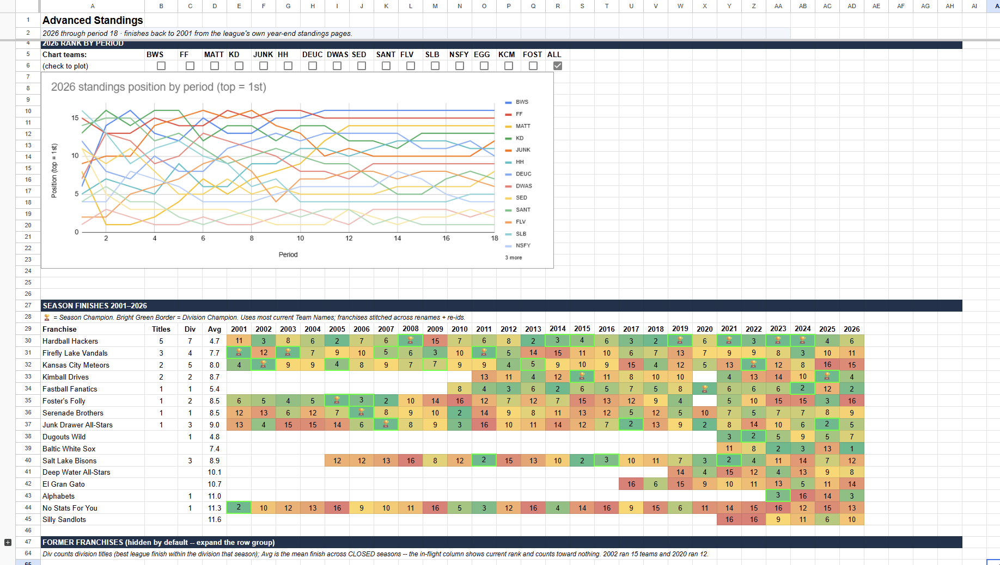

**What you are looking at:** The matrix under that chart is **26 seasons of data (2001-2026), 25 completed** -- one league in a single grid. Stitching it together is the hard part. Franchises get renamed, handed to new owners, and re-issued fresh platform ids, so one continuous team can surface under three names and two identities across the run.

Resolving that lineage is what lets a single row credit the Hardball Hackers with five titles and a 4.7 average finish over a quarter-century, instead of scattering them across three unrelated rows.

The honesty note is the other half. Only 2026 was captured live. For our ESPN league, 2025 lineups and scoring still existed at full fidelity -- with one exception worth telling, because it is the kind of thing that hides, and because it is a defect this project found in its own work rather than one anybody reported: ESPN's *player record* carries only a player's current MLB club, so a season loaded after the fact cannot say from that field which club he was actually playing for. Measured against 2025, it was not small -- 22.25% of the roster-affinity chart's weight was filed under the wrong club, and a further 11.7% could not be placed at all. That is fixed. The club now comes from the game rather than from the person: each per-scoring-period split already carried the club the player was actually with, and the chart reads that, so the unplaceable band measures 0.0 across 2025, 2026 and all-time. The measurement and the fix both stay in [Known Data Issues](docs/known-data-issues.md) rather than being quietly deleted -- a closed defect is still part of the record. For CBS, we needed some clever reconstruction.

2004-2020 is estimated from start-share rates, and it always runs under rather than over -- but the error is not uniform across that stretch, so it is worth stating as the ladder it actually is: roughly unbiased 2005-2010, undershooting about 8-13% from 2011, and around 20% for 2020, the short COVID season with the thinnest log. (Actual sit/start data is not available from that era, so it is estimated from site-wide numbers. It is a foreseeable selection bias that a league with 25 completed seasons behind it made, on average, better start/sit decisions than the average random CBS subscriber.)

2021-2025 is reconstructed day by day from the transaction log (which for this era _does_ include sit/start transactions).

2001-2003 is the weakest stretch in the book, and it gets said out loud rather than buried: there are no year-end roster pages to anchor the reconstruction, so a player who was drafted and simply held all season -- never added, dropped, or traded -- never touches the transaction log, and the walk-back has no way to place him on a roster at all. Those are disproportionately the stars. That's a coverage gap, not an accuracy one: team-level error for 2001 and 2002 actually runs about 12-15%, in the same range as the estimated era above -- the honest number is that roughly a quarter to a third of those two seasons' true production is currently unassigned, parked in a clearly-labelled placeholder franchise rather than being silently credited to somebody, with both years labelled directional wherever they appear until that gap closes. That error bar is on reconstructed *point totals* only -- season finishes come from the league's official published standings, so the finish matrix above does not inherit it.

Every era's provenance ships as a visible disclosure, not a footnote; the Home tab's Stat Sources table and every team page state plainly which years are captured live, reconstructed day-by-day, or estimated, and what share of the record falls into each bucket.

---

## The Big Picture

<!-- WORDING IS DELIBERATE: "one run of the pipeline", not "one command".
     The weekly loop is four invocations (extract -> dbt build -> render,
     plus the optional CBS capture) and SETUP.md documents it as such, so
     "one command" contradicted our own runbook. A true single command is
     actively landing via the phase-5 wrapper (cf. tools/duckdb_run.sh,
     which already does this for the DuckDB target); when that ships for
     the weekly loop, this sentence can go back to "one command" -- until
     then, do not. MLB-157. -->
Every Sunday, one run of the pipeline turns a week of fantasy baseball into a formatted recap: best and worst matchups with their top contributors, the wasted-performance callouts, and any records broken or tied.

That was the original product, built to automate a tedious manual process for my personal league.
It has since grown into a cross-platform data model that produces customized, browsable "Almanacs" containing entire league histories.

The same transform layer now serves **two leagues on two different platforms with two different formats**: a head-to-head league where teams play each other weekly, and a season-long points league whose history runs back to **2001**.

Neither platform's website will tell you what its own rosters looked like fifteen years ago. So the pipeline rebuilds them: a day-by-day reconstruction from **55,980 player-actions across roughly 25,700 transactions**, anchored on year-end roster snapshots, cross-checked against the league's official published standings, and **graded**. What the almanac prints on its own surfaces is each era's *provenance* -- how much of it was captured live, reconstructed day by day, or estimated. The measured error rates behind those labels come from the reconciliation contract, which grades every reconstructed season against the official standings, and they are stated per era rather than as one number.

On top of that sits a record book that had to be built from scratch, showing individual performances and statistical outputs at a grain that is not visible on either platform's website.

---

## The two-league story

The pipeline was built for one league on one platform. Adding a second one that shares almost none of the first one's assumptions is the test that made this into a real model, rather than a pile of league-specific SQL.

|                               | League A                       | League B                                                       |
| ----------------------------- | ------------------------------- | --------------------------------------------------------------- |
| Format                        | Head-to-head, weekly matchups  | Season-long points, no matchups                                |
| History available             | Recent seasons, fully recorded | Back to 2001, mostly *not* recorded                            |
| Per-day scoring from platform | Yes                            | **None -- season totals only**                                 |
| Roster history                | Served by the API              | Reconstructed from transactions                                |
| Position eligibility          | Served by the API              | Derived from real MLB game logs, in concert with league settings |

What made this tractable rather than a fork:

- **One warehouse, one set of models, a `league_key` grain.** Per-league schemas were considered and rejected. Every fact and mart carries the league key; the output layer filters. It is designed so that a new league on an already-supported platform is configuration rather than code -- though in fairness that is designed-and-unexercised, not proven: both books today are one league per platform. The packaged sample league (MLB-11, scoped to v2.1) is the live test, and it carries a zero-new-models acceptance rider precisely so the claim gets checked instead of assumed.
- **Platform vocabulary is translated at staging; platform *work* converges at the facts.** Stat ids, slot ids and format labels stay native in staging and are mapped to a canonical catalog through seeds. Where a platform serves something the other cannot -- CBS has no per-day scoring, so its roster stints, lineup intervals and eligibility windows have to be reconstructed -- that reconstruction gets its own `int_cbs__*` models and lands in the shared fact family. Thirteen models below staging are platform-specific by design; everything downstream of the facts speaks one language. The rules are written down in [docs/platform-adapter-contract.md](docs/platform-adapter-contract.md).
- **Format is a separate axis from platform.** "Points league" and "which website" are independent dimensions, so a feed can be required, optional, or conditional on format rather than on vendor.
- **The universal layer is real baseball.** Stats come from the public MLB Stats API, not from a fantasy vendor, so the underlying numbers are never in doubt. Only the fantasy state around them (who owned whom, who was in the lineup on a given day) has to be reconstructed.

The payoff is measurable: both leagues' team pages render through the *same* builder, in the same shape, from a shared convergence layer -- the two screenshots below are one code path fed two `league_key`s. Several other tabs (Home, Records, Advanced Standings, Draft Recap) still have a platform-specific renderer each; collapsing those onto the shared path is ongoing.

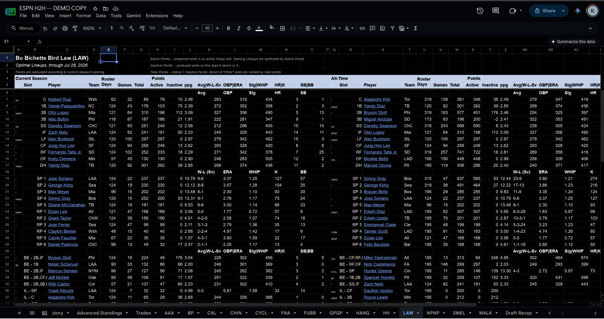

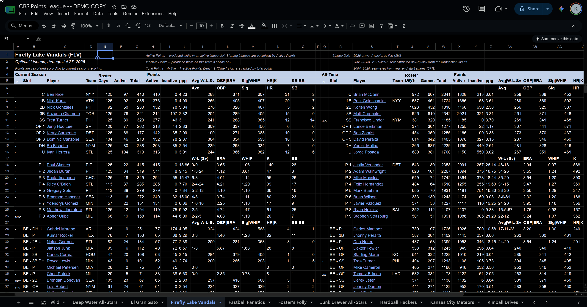

*Identical layout, rendered from two different platforms, with points calculated according to each league's own scoring settings and each team's actual history -- the single best evidence for the whole adapter thesis. Same tab builder, same columns, fed a different `league_key`.*

---

## Architecture

Four layers, one warehouse, two platforms:

```
ESPN + CBS extract  ->  RAW (append-only, platform-native shape) --
                        Snowflake, or parquet on disk loaded into DuckDB
                    ->  dbt staging (canonicalized to one vocabulary)
                    ->  dbt intermediate (identity resolution, walk-backs)
                    ->  dbt marts (core contracts + reporting)
                    ->  weekly recap · records report · Google Sheets almanac
```

Built on dbt + Python over Snowflake or DuckDB: extract scripts land raw JSON, dbt owns everything from staging through marts, and the Python output layer reads the marts to produce the recap, the records report, and the almanac. Four of those consumers are formally declared as dbt exposures, so the lineage graph runs source → deliverable; the declared set is hand-maintained and currently incomplete, which is stated plainly in [dbt_league/README.md](dbt_league/README.md#exposures). A full lineage/DAG image is coming once the current model-renaming refactor settles; drawing one today would be stale within weeks. The [hosted dbt catalog](https://kyledawson24.github.io/fantasy-league-almanac/) has the real, current lineage and column-level docs if you want that today; it's regenerated manually and regularly, so treat it as approximate rather than live (as we approach final state, I will update this doc accordingly).

---

## What it produces

**A weekly BBCode recap**: best/worst matchup totals with top contributors, wasted performances, records broken. Written to a timestamped file, ready to paste into ESPN's front page in a format that renders on its stone-age level text editor.

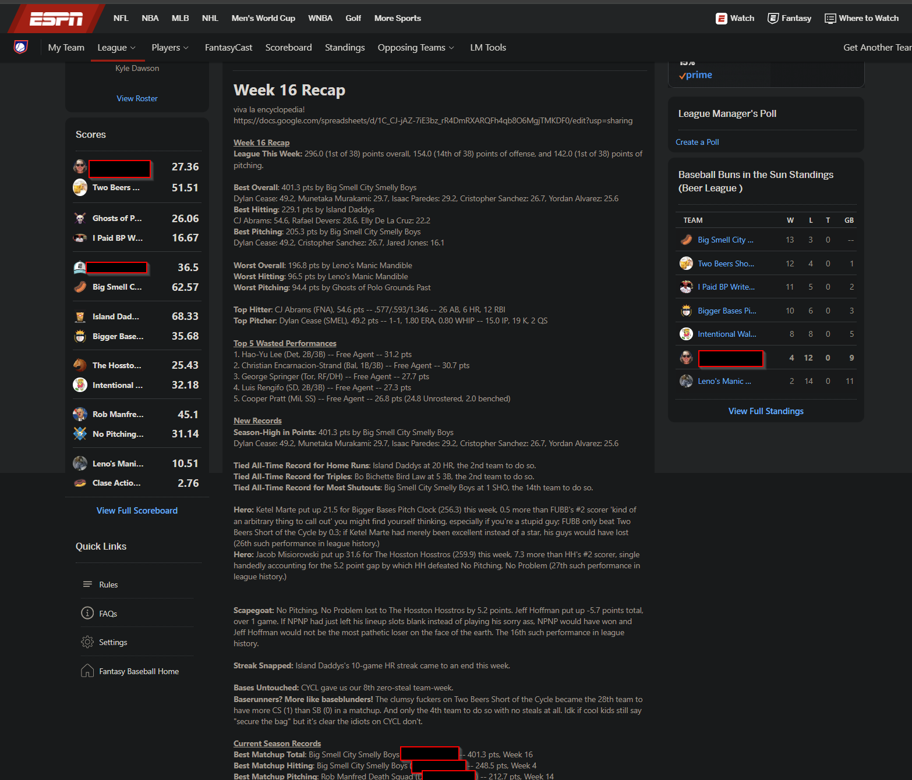

*Posted straight to the league's actual ESPN front page; this is Week 16, live, not a mockup. Even the jokey callouts are scripted, by a purpose-built callout script (`output/league_notes.py`). This is personalized league content: the recap is generated per league, and which callouts fire is configurable.*

Alternate Recap, as text:

```
[u][b]Week 6 Recap[/b][/u]

[b]Best Overall[/b]: 309.4 pts by No Power, No Panic
Bobby Witt Jr.: 32.7, Cam Schlittler: 30.9, Pete Alonso: 24.8, ...
[b]Best Hitting[/b]: 184.3 pts by Intentional Walk to the Bar
Andy Pages: 37.4, Pete Crow-Armstrong: 26.4, Matt Olson: 21.2
[b]Best Pitching[/b]: 156.6 pts by Rob Manfred Death Squad
Logan Gilbert: 29.6, Nathan Eovaldi: 25.6, Rico Garcia: 20.7

[b]Top Scorer[/b]: Cristopher Sanchez (SMEL), 52.6 pts -- 15.0 IP, 17 K, 2 W, 2 QS
[b]Top Hitter[/b]: Andy Pages (WALK), 37.4 pts -- .417/.440/.917 -- 24 AB, 4 HR, 8 RBI

[u][b]Top 5 Wasted Performances[/b][/u]
1. Heliot Ramos (SF, LF) -- Atomic Alpacas Assuming Position --
   27.9 wasted pts (3.4 unowned, 20.3 benched, negative 4.2 active)
2. Brandon Marsh (Phi, LF/CF) -- Clase Action Lawsuit -- 26.2 pts
...

[u][b]New Records[/b][/u]
[b]New Worst Player Platform Hitting Points[/b]: Cal Raleigh (NPNP), -6.2 pts -- 8 AB
(Prior: -6.0 pts by Mark Vientos (NPNP) in Semi-Finals of 2025)
[b]Tied Record for Fewest RBIs[/b]: Leno's Manic Mandible at 14 RBI, the 3rd team to do so.
```

*(A real Week 6 recap, lightly trimmed for readability.)*

**An all-time records report**, and **a multi-tab league almanac in Google Sheets**: Home, Records, Advanced Standings, Draft Recap, a matchup history, a trade board, and one page per team. How to read it is documented in the [user guide](docs/user-guide/).

Browse a real rendered almanac: the [H2H league sample](https://docs.google.com/spreadsheets/d/1gj4Lfp098asXtCRHmTzM6gWhzgfZiQ9urUMQ3oPqJzU) and the [points league sample](https://docs.google.com/spreadsheets/d/1mZeqeIQZeIFjs5Kj3LUwQcWU0pBh03sBep8RKwXJVo8), both read-only. These are copies of the real books with owner and franchise identities swapped for the same twins the demo fixture uses; the player names, the stat lines and every number in them are real.

A few of its tabs:

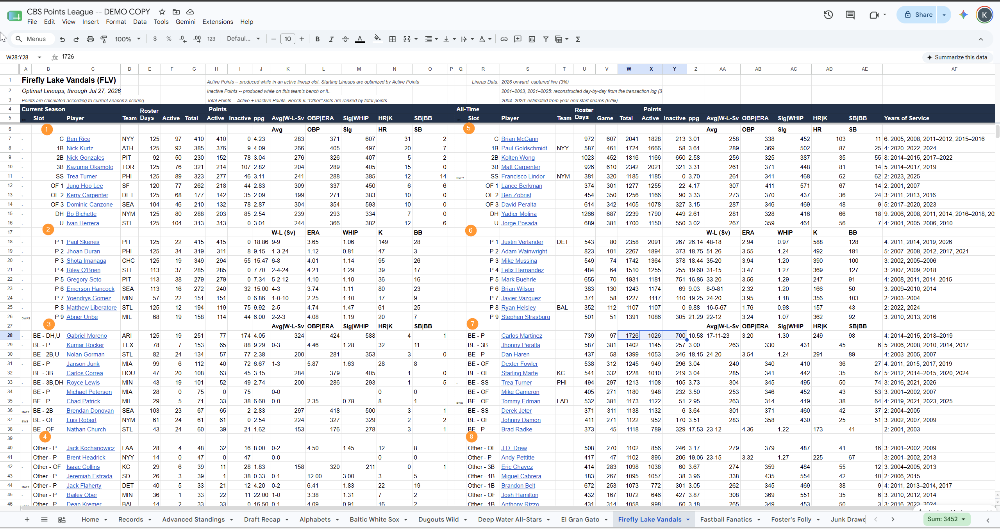

*Team Tab: arguably the core deliverable of the project; a team's current-season top producers, its all-time optimal lineup, and every player's actual stat line for their specific time on this team, not their career or league-wide numbers. The single view of "who are my team's guys" as though your fantasy league was a real world competition.*

<!-- VERIFIED 2026-07-31, MLB-157 -- do not "correct" the ranking. "Third-biggest
     if never benched" means his unbenched total (1726) inserted into the
     franchise's ACTIVE pitching leaderboard, which is the list the team page
     renders: Verlander 2091, Wainwright 1894, [1726], Mussina 1364 -> 3rd.
     Ranking him among everyone's UNBENCHED totals instead gives 5th; that is
     the wrong comparison set. Other halves check out too: bench share 40.6%,
     active-weighted ERA 3.198 -> 3.20, career 3.74 exactly (402 ER / 967.0 IP),
     active rank 11th vs 9 P slots. NB the 2004-2020 era has no boolean bench
     flag -- IS_ACTIVE is NULL and attribution is a fractional ACTIVE_WEIGHT, so
     `WHERE IS_ACTIVE` returns nothing and looks like a falsification. -->
**One thing this makes possible that no standard fantasy site can answer:** Carlos Martinez spent more time on FLV's roster than almost anyone in franchise history, and if he'd never been benched he would have been the franchise's third-biggest pitching contributor of all time. But he scored over 40% of his points from the bench, and ends up missing the "Starting Lineup" entirely. That said, he was used well: his 3.20 ERA while active for FLV beats his career mark of 3.74 by more than half a run.

That comparison -- not his career line, the line for what he actually did *for this team, in the games this team started him* -- only exists because the pipeline creates visibility into active-vs-benched performance for every player, every day, across all 26 seasons.

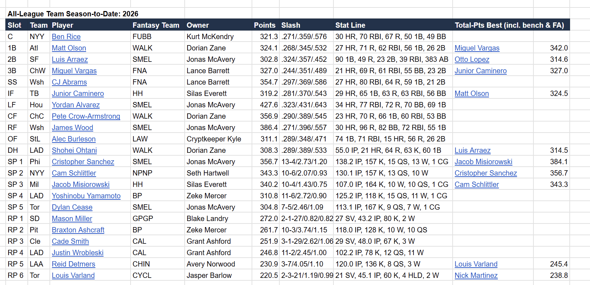

*All-League Team: the season's best player at every lineup slot, with the fantasy team that rostered them and what the best bench or free-agent alternative would have scored. Automatically assumes the shape and restrictions of the league's roster settings.*

**Answers questions the native site can't:** "What players have actually had the biggest impact on *this league* this season, as opposed to overall production in the MLB?"

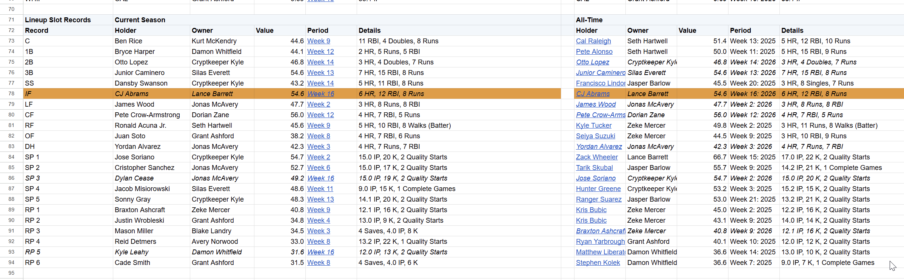

*Lineup Slot Records: the current season's best single week at each slot beside the all-time holder. New records automatically highlighted for the period after their occurrence.*

**Answers questions the native site can't:** "What's the best matchup a shortstop has ever had under our new scoring system?"

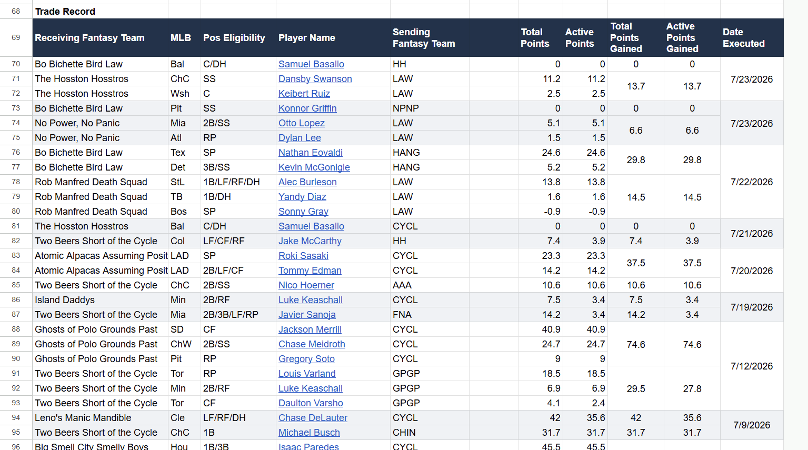

*Trade Record: every completed trade, grouped, with what each side's pieces actually scored after the deal.*

**Answers questions the native site can't:** "How has the multi-player trade I made 4 months ago worked out for me?" or "What's the biggest blockbuster in league history where the most total points changed hands?"

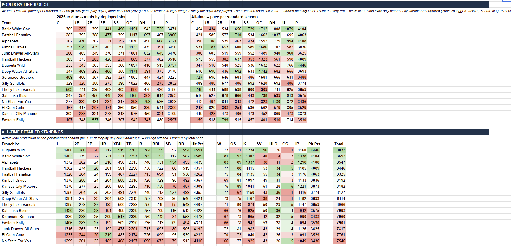

*Points by Lineup Slot: production by the slot it was deployed in, paced per standard season so shortened and in-flight years compare honestly.*

**Answers questions the native site can't:** "Which owners historically build their teams around certain positions?" or "Which contending teams this season have an obvious hole in their roster, and would they make good trade partners?"

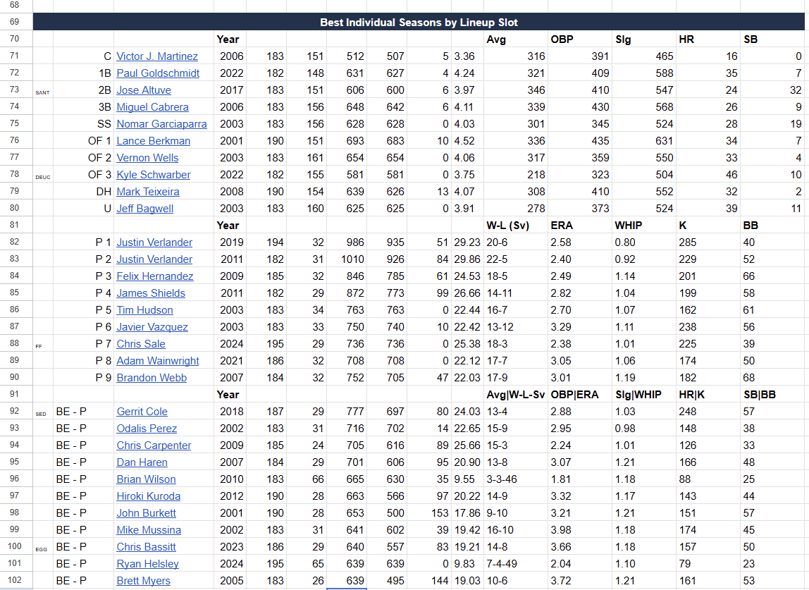

*Best Individual Seasons by Lineup Slot: the top single season at each slot, back to 2001, re-priced under one rulebook so eras sit on the same scale.*

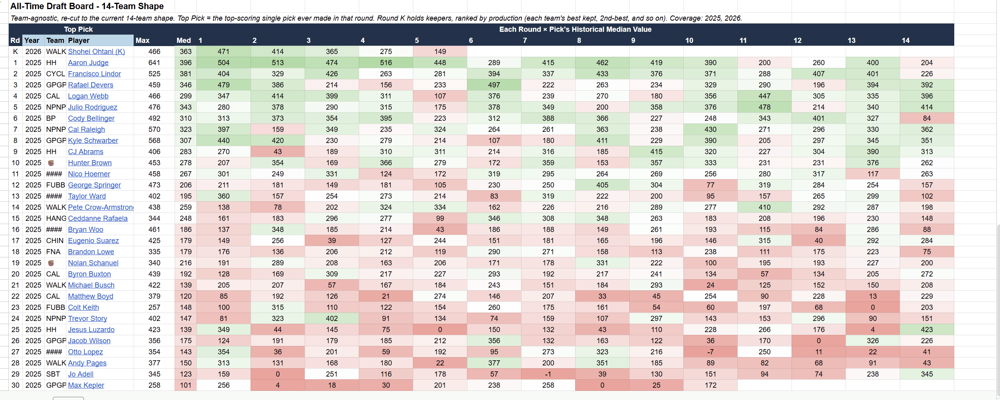

*All-Time Draft Board: every pick, re-cut to the league's current team shape, colored by value against that round's historical median; the keeper row ranks by production.*

**Answers questions the native site can't:** "What is the draft pick I was just offered in a trade actually worth?" or "How many points does my first rounder need to score before I can call it a successful decision?"

---

## What's next

**v2.0 has one goal: a stranger with an ESPN or CBS league enters some credentials, runs some things, and gets an almanac their league can open.** That last clause is literal -- a workbook in their own Drive with sharing set, because a league almanac the league cannot open is a demo rather than a product. ESPN end to end is the hard requirement and the gate. CBS has since been priced, and the answer was *probably too expensive for the 2.0 critical path* -- so the shared machinery keeps the CBS path alive, and if ESPN is release-ready while the measured CBS remainder is short and adds no new risk, CBS can still ride along. Otherwise it is an urgent fast-follow rather than a gate.

It is a failure-cost argument, not a feature list: bugs are certain in something this young, and someone who filled in a few fields and hit one stays interested, while someone who provisioned a cloud warehouse first leaves annoyed. So the upfront demand has to be near zero. The first keystone -- teaching the extract to write raw data locally -- **shipped in v1.8.0** (MLB-208): a fresh clone with league credentials and no warehouse account of any kind now reaches rendered preview files, so the quickstart no longer asks for one. The second keystone -- ending the journey in a shareable workbook (MLB-209) -- now has its **service foundation on `main`**: an isolated `drive.file` OAuth profile that asks for less, an app-created workbook with its own lifecycle, link sharing proved rather than assumed, and a consent screen measured on a clean consumer account. What remains is wiring and documenting that into the complete stranger orchestration, and walking the real almanac journey end to end. So 2.0 is closer, not done. The charter is MLB-210.

Beyond that: the platform half -- Yahoo and Sleeper adapters, to prove the platform-agnostic design against a third and fourth vendor -- and a player-entity layer (`dim_player` / `fct_player_career`) with more analytics surfaces on data the pipeline already has. Full detail (including what's been explicitly decided against) is in [ROADMAP.md](ROADMAP.md).

---

## Quick start

**Just here to look?** The screenshots above and the [hosted dbt catalog](https://kyledawson24.github.io/fantasy-league-almanac/) cover the design; [docs/user-guide/](docs/user-guide/) covers how to read the almanac itself.

**Want to run it?** [QUICKSTART.md](QUICKSTART.md) is the short path: the fields to fill and the commands to run, one screen, with every step linked into SETUP.md. Read the three notes below first, because they set expectations that the quickstart then assumes.

- **The engine port has landed.** The transform layer builds on DuckDB as well as Snowflake: engine-specific SQL sits behind adapter-dispatch macros, and the output layer can point at either. That is done and exercised locally, not planned.
- **`tools/demo.sh` is a build-and-render wrapper, not a demo you can run from a clean clone.** It builds the chain and renders the almanac off the tracked demo fixture in its own local warehouse, with no Snowflake account and no Google credentials -- but it does not land raw data and will not invent any, so on a clone that has never run an extract it says so and stops. It is maintainer scaffolding until the packaged sample exists.
- **A credential-free clone-and-run demo does not exist yet.** The missing pieces -- a packaged sample league, and onboarding that needs no `.env` edit and no flags -- are tracked together as MLB-11 and scoped to v2.1. Until then, running this means bringing your own league -- but, since v1.8.0, no longer your own warehouse: `extract.py --raw-target local` lands RAW as parquet on disk for DuckDB, so [QUICKSTART.md](QUICKSTART.md) needs no cloud account (ESPN only; CBS capture still needs the browser-credential route). [SETUP.md](SETUP.md) remains the walkthrough for the Snowflake path (~30-45 minutes, mostly provisioning).

The portability spike that sized the transform-layer port, including the traps it found, is written up in [docs/duckdb-portability-audit.md](docs/duckdb-portability-audit.md).

**What it takes to run.** The full 26-season, 441-team-season, 1.09M-player-game reconstruction builds comfortably on a 16 GB machine, and on the DuckDB target it completes at a **6 GB memory cap, in a single run, with engine threads pinned**. Both of those are where it has been tested -- not guaranteed minimums, and not ceilings. Peak resident memory was measured at **5.970-5.980 GiB** at that 6 GB cap: three runs on 2026-08-02, across two execution paths, landing inside a 10 MB span. The engine spends its budget rather than economising, so the durable shape is peak RSS ~= cap + ~0.4 GB -- lower `DBT_DUCKDB_MEMORY_LIMIT` and the peak follows it down, at the cost of more spilling to disk. The full series, its instrument, and the caveats that travel with it are in the [portability audit](docs/duckdb-portability-audit.md#the-peak-rss-series-2026-08-02).

---

## What this demonstrates

The current shape of the transform layer: **78 dbt models** (36 views, 39 tables, 3 incremental), **19 seeds**, **573 data tests**, **27 sources**, and **4 declared exposures**. These counts are regenerated from the parsed manifest at each release cut; if you are reading them mid-cycle, `dbt parse` and the manifest are the truth.

Most of that needs a warehouse to exercise, but not all of it: with no account and no credentials, `dbt deps && dbt parse` compiles the project and `pytest tests/` passes. On CI's clean Linux checkout of `main` that reads **749 passed, 3 skipped, 27 deselected** -- the warehouse-marked goldens deselect, and the tests wanting private regression corpora skip rather than fail. Your own checkout will print different totals: some tests need a POSIX shell and skip on Windows, and any untracked work of your own is collected too. Counts drift between releases; `pytest tests/ -q` on your machine is the truth.

- **Modeling that survived a second implementation.** Wide convergence facts at consumer grain; a symmetric active/inactive split ("active is fantasy reality, inactive is MLB reality") that is what makes wasted-production analysis possible at all; a seed-driven UNPIVOT mart where adding a tracked stat is a CSV row rather than a five-file SQL change.
- **Reproducibility.** Floating-point sums are not associative, and SQL engines do not promise summation order, so rebuilding with no code change could move a rendered cell by one, and oh boy it often did. Sums now run in exact decimal with pinned tie-breaks, and a byte-diff harness pins a known week so any drift fails loudly.
- **Reconstruction with published error bars.** The walk-back does not claim to know what it cannot know. Where records are simply unavailable we make that clear and render a zero. The resulting under-count is stated per era instead of being smoothed away (while still allowing manual override tables to populate data manually where a "league historian" might know something that the platform's API no longer stores).
- **Cross-language data contracts.** One seed CSV drives both the dbt mart's Jinja loop and the Python display, polarity and record-surfacing logic.
- **Portability assessed, not assumed.** A spike ported the staging layer to DuckDB on real data to size a warehouse-independence effort honestly, including the traps; a 32-bit `FLOAT` that silently narrows values, and an engine default that would have emptied the record book without erroring. Written up in [docs/duckdb-portability-audit.md](docs/duckdb-portability-audit.md) -- and the port it sized has since landed, behind adapter-dispatch macros.
- **Real-data debugging discipline.** A doubleheader bug in an upstream wrapper found from team totals running ~3.6 points low; a scoring category whose season feed disagrees with its own per-game data; a record book rebuilt after discovering its source neglected significant portions of the player pool. Each documented with the evidence.

---

## Project documentation

- **[dbt_league/README.md](dbt_league/README.md#the-dag-top-to-bottom)** -- how the
  transform layer is organized, walked top to bottom, including the edges
  that look odd and why they are that way.
- **[docs/user-guide/](docs/user-guide/)** -- how to read the almanac,
  written for league members.
- **[SETUP.md](SETUP.md)** -- bring-your-own-credentials walkthrough.
- **[docs/known-data-issues.md](docs/known-data-issues.md)** -- the list of gaps, caveats, and open questions.
- **[docs/platform-adapter-contract.md](docs/platform-adapter-contract.md)** -- the shape a new platform has to land data in.
- **[docs/PRIVACY.md](docs/PRIVACY.md)** -- whose data is in here, what is synthetic, and what is never committed.
- **[CHANGELOG.md](CHANGELOG.md)** · **[ROADMAP.md](ROADMAP.md)** -- version history, and what is Now / Next / Later / Decided Against.
- **[docs/archive/](docs/archive/)** -- the phase documentation (`Phase X.Y Documentation.md`), session handoffs and progress journals, each phase doc with an "options considered → chosen → rationale" section. These were all pre-release/exploratory; their only real purpose is archival.
- **[docs/decisions/](docs/decisions/)** -- the short list of design documents still in force.
- **[Hosted dbt catalog](https://kyledawson24.github.io/fantasy-league-almanac/)** -- model lineage and column-level docs, regenerated manually (may lag a release or two behind local `main`).

---

## Status

- **v1.8.0** -- current, 2026-08-10. The engine runs locally, end to
  end: `extract.py --raw-target local` lands RAW as parquet plus a
  manifest, so a fresh clone with league credentials and **no warehouse
  account of any kind** reaches rendered previews. ESPN only -- CBS
  bring-your-own is not in this release. ESPN's own settings and
  standings are now captured from views every run already fetched and
  discarded, and the head-to-head standings render in **the platform's
  own seed order** rather than a wins-then-points sort, which no sort
  over wins or points recovers. The podium is marked on both books
  (🏆 champion, 🥈 runner-up, 🥉 third), keyed on the post-playoff
  finish rather than the seed where a league has a bracket. Underneath:
  eight crash paths a stranger's first run would have hit, and a
  lineup-slot fallthrough that was silently deleting pitcher
  production. Full notes:
  [RELEASE NOTES v1.8.0.md](RELEASE%20NOTES%20v1.8.0.md).
- **v1.7.0** -- 2026-08-05. The first public release, and three
  things at once: the **DuckDB engine port** lands (the transform layer
  builds on either engine, though nothing lands raw data outside
  Snowflake yet), production is credited to the **club of the game**
  rather than the club on the player record, and the public face went
  through a cold review, a truth pass and a fail-closed hardening batch.
  New surfaces: CBS Season History and two Halls on the head-to-head
  book. New on-ramp: [QUICKSTART.md](QUICKSTART.md), interim and honest
  about it. **Existing installs must run the club-of-game backfill**, and
  the build fails until they do. Full notes:
  [RELEASE NOTES v1.7.0.md](docs/releases/RELEASE%20NOTES%20v1.7.0.md).
- **v1.6.0** -- 2026-07-30. The pre-port anchor release: the Points Glossary settles on the Total-Points lenses, Advanced Standings moves its era and scope text into the section banners, and a re-render hygiene gap that had been quietly layering each render over the last one is closed across every ESPN writer. Underneath, a determinism sweep pins every row-selection tie so no database engine gets to choose a value -- groundwork for the DuckDB port, and the last stable point before it.
- **v1.5.1** -- 2026-07-25. A correctness pass on the CBS record book: fixed non-deterministic rebuilds, a silent transaction-capture gap (~408 rows dropped across 26 seasons of history), records that were rounded twice, and player identity that gave up whenever a name had two candidates. Patch, not minor -- everything in it corrects an existing surface rather than adding one.
- **v1.5.0** -- 2026-07-21. The multi-league release: a league registry and a `league_key` re-grain of every layer, and the CBS points league (2001-2026) ships end to end through the same tab builders as ESPN. Advanced Standings, Trades, Baseball Reference links, and a reworked Draft Recap land on the ESPN side in the same release.
- **v1.2.0** -- 2026-05-30. Home became a navigation-hub dashboard, and a net-new Draft Recap tab (draft board plus draft-value analysis) landed. (1.3 and 1.4 were internal working labels during an unreleased stretch, skipped deliberately to keep the docs unambiguous.)
- **v1.0.0 - v1.1.2** -- the original single-league ESPN foundation: the weekly BBCode recap, the all time records report, and the first Google Sheets almanac. Full per-release history in [CHANGELOG.md](CHANGELOG.md).
- **License**: MIT (see [LICENSE](LICENSE)).
- **Built with**: dbt 1.11 · Snowflake or DuckDB · Python 3.13 · `espn-api` wrapper · `gspread`.

## Contact

Email: kpdawson.github@gmail.com
LinkedIn: https://www.linkedin.com/in/kyledawson24/
Ko-fi: https://ko-fi.com/kpdawson24

## Contributing

This is a personal portfolio project and I'm not accepting code contributions (pull requests) for now -- it keeps the licensing story simple while the project's future shape settles.

Issues, bug reports, and feedback are very welcome.

