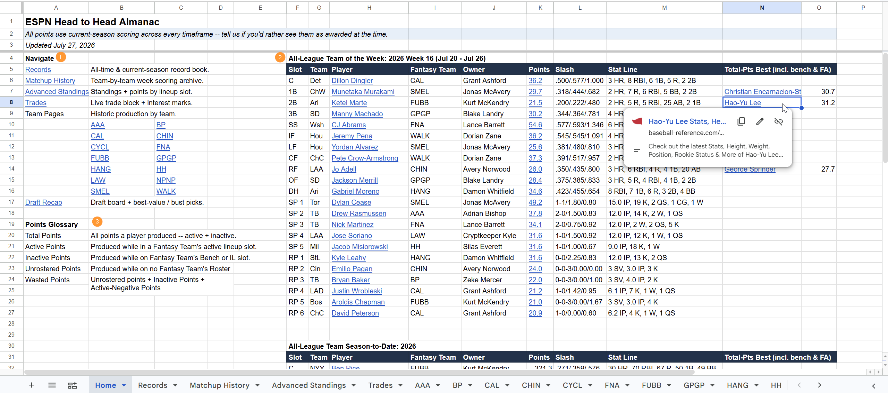
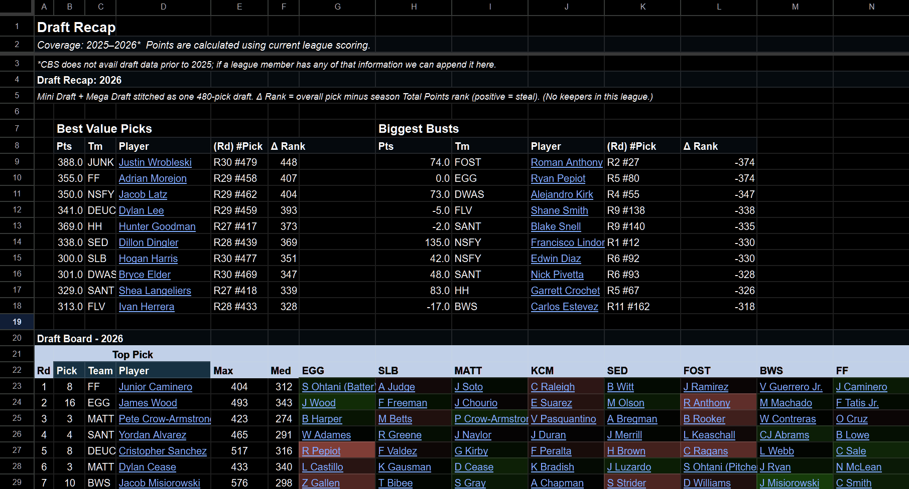
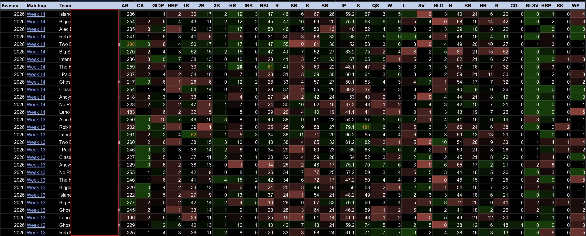

# Reading the almanac

## The tabs

### Home
The landing page, laid out in two bands.

The **left band** is navigation and reference: links to every other tab, a grid of links to each team's own page, and the

**Points Glossary** -- the short definitions of every points column used elsewhere in the workbook. If a column name anywhere confuses you, the glossary is the first place to look. 
Where relevant, this section also carries a **Stat sources** table, which says where each era's numbers came from; see [Stat sources and fidelity](03-stat-sources-and-fidelity.md).

The **right band** is the "best lineup" boards -- an all-league team assembled from everyone's production, not just one roster, foregrounding by "Active Points" -- those produced while part of a team's active lineup. 

Head-to-head leagues show "Team of the Week" -- biggest producers of the most recently completed matchup.
Season-points leagues show "Team of the Month" -- biggest producers of the month, rollover on the 8th

Both league types show "All-League Team Season-to-Date" and All-Time. 

"Stat Line" shows each player's active production in descending order of what produced the most points. The Column immediately to the right shows who "would have" made the given team if all points counted instead of just active. To ease readability, that column only populates when there is a divergence in the player selected -- if the only difference is the point totals (eg top active player achieved the title despite sitting 1 game), the column remains blank.

The All-Time board carries **Years of Service** in that position instead: the number of seasons the player logged active production for any team in the league, followed by the seasons themselves as compressed ranges (`1: 2026` for a first-year player, `21: 2001–2019, 2021–2022` for a long career with a gap). A net-negative season still counts -- a bad year is still a year of service. The board's title carries the measured era, e.g. `All-League Team: All-Time (2001–2026)`.

These are computed lineups, not awards -- how they are chosen is explained in [The points
lenses](02-points-lenses.md).

### Records
The record book, laid out as two scopes side by side so you can see at a glance whether something that happened this season is also an all-time mark. It is sectioned into score records, hitting, pitching, and records by lineup slot.

Read the subtitle before reading the numbers. It states the minimum
volume a rate stat needs to qualify (a one-inning relief appearance
should not own the ERA record) and explains the italic and highlight
marks used in the table.

Both leagues' Records tabs also carry a **Franchise Hall of Fame** -- the
best careers anyone spent with a single franchise -- and, beside it, a
**Wasted Hall of Shame**: the careers that left the most production
unused, pitchers and hitters ranked on separate boards.

### Advanced Standings
Myriad views of historic performances and points-by-source breakdowns. 

It contains, in order: 
A togglable rank-by-week chart for the current season. 
Historic standings.

Points by lineup slot, current season & all-time 
Per-stat weekly-average standings, current season & all-time

Points by Acquisition Channel, current season & all-time -- how much of your output came from drafted players versus waiver pickups versus trades

A roster-affinity chart showing which real MLB clubs you lean on. Every club on it is the club of the *game* the production came from, so a player who was traded mid-season splits across both clubs on the days he actually played for each.

### Trades (currently ESPN league only)
The current trading block and a scoresheet of the season's completed trade record.

This is the one tab that reads the fantasy platform live at render time rather than the warehouse. If that call fails, the tab keeps whatever it showed last run rather than blanking. 
So if the Trades tab looks stale and everything else looks current, that is the reason.

### Draft Recap
Best values and biggest busts, then the season's draft board. 

Below that is an all-time board re-cut to the current team count, so drafts from years when the league was a different size still line up in a readable grid.

### Team Tabs
Each team gets its own page, showing its **own best lineup** according to who produced while active for their team. 

Current season and all-time sit side by side: the optimal starters, then bench, then injured list, then everyone else who ever appeared, then a summary line for the long tail. 

There is also a Best Individual Seasons block, and a franchise-futility entry that you may or may not want to look at.

The head-to-head league titles these tabs with the team abbreviation; the points league uses the full team name, and adds a per-era **Lineup Data** note explaining how much of that era's day-to-day detail is reconstructed rather than recorded. That note matters -- see [Stat sources and
fidelity](03-stat-sources-and-fidelity.md).

### The history tab, at the end of each book

Each book closes with its own history tab, after the team pages, appendix style. They are the same idea at two different grains: one row for every unit of competition the league has ever played. The head-to-head league plays weeks, so its row is a team-week; the points league never plays a matchup at all, so its row is a team-season.

#### Matchup History (head-to-head league only)

One row for every team-week ever played:

The per-stat lines, hitting and pitching and total points, the margin, the result, the combined total of both sides, and the league average that week.

#### Season History (points league only)

One row for every team-season ever played -- 395 of them across 25 completed seasons, newest first, ranked within each season.

The columns mirror Matchup History's, re-grained: the same hitting and pitching stat blocks in the same order they appear on the Records tab, then Hitting, Pitching and Total Points, the margin, and the league averages for that season. What differs is the result. There is no opponent to beat in a points league, so instead of a W-L record each team carries **Outscored** and **Outscored By** -- how many of that season's other teams it finished above and below -- plus **Ties**.

Those three always sum to one less than the number of teams that season (everyone except yourself). Ties are rare but real: in 2024 two teams finished on exactly the same total and the platform awarded them joint third, so each reads 12 -- 2 with one tie.

Three things worth knowing before you argue with a row:

- **The points columns are what the league actually awarded**, taken from the published year-end standings rather than recomputed. This is the one place that matters most: re-scoring history under today's rulebook changes the rank of 307 of the 395 team-seasons and would hand 15 of the 25 championships to somebody else. The stat blocks beside them *are* reconstructed -- no platform ever published a team-season stat line here -- but the outcome is the league's own.
- **The current season is not on it.** Only completed seasons appear, so a year in progress never sits next to finished ones as though it were done.
- **Owner names are blank before 2007**, and the 2001--2002 stat blocks read low against their own points totals. Both are limits of what survives from those years, not statements about those teams -- the earliest seasons are rebuilt from a transaction log, and a change log cannot see a player who never changed hands. The points columns beside them are unaffected. See [Stat sources and fidelity](03-stat-sources-and-fidelity.md).

## Two things worth knowing before arguing with a number
**Every points column has two versions.** One is what the platform actually awarded; the other is what the same performance would score under this season's rules. They disagree on purpose. Anything that compares across seasons leans on the second: pricing every year with one rulebook is the closest to equal footing the numbers can get. [The points lenses](02-points-lenses.md) explains which is which and when to trust each.

**The older the season, the more of it is reconstructed.** Years post "implementation" are captured directly, and more recent years maintain record fidelity that allow for very accurate reconstructions. Older years are rebuilt from transaction logs, and the earliest are estimated using REAL team-specific roster data, but aggregate guesses at start/sit decisions. The almanac labels this per era rather than hiding it -- see [Stat sources and fidelity](03-stat-sources-and-fidelity.md).
